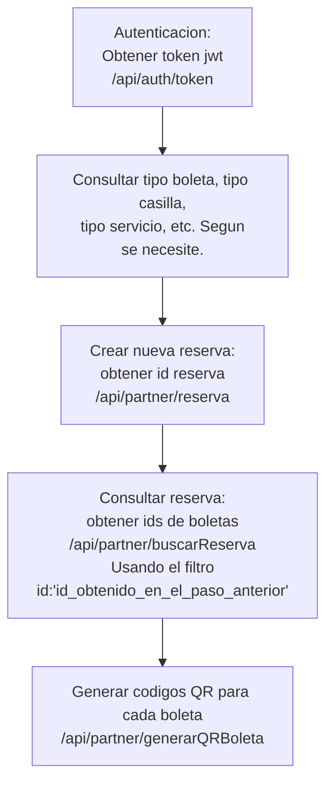

# PCA API Integracion Partners

* [Autenticacion](https://github.com/INFOMEDIA-SERVICE/pca_partner_doc/blob/main/auth.md "Autenticacion")
* [Integracion Partner](https://github.com/INFOMEDIA-SERVICE/pca_partner_doc/blob/main/partner.md "Integracion Partner")

------------

* [¿Como usar el filtro de busqueda?](https://infomedia-service.github.io/docs/filter/v2/syntax.html "¿Como usar el filtro de busqueda?")

------------

#### Crear reserva de boletas y obtener codigos QR

